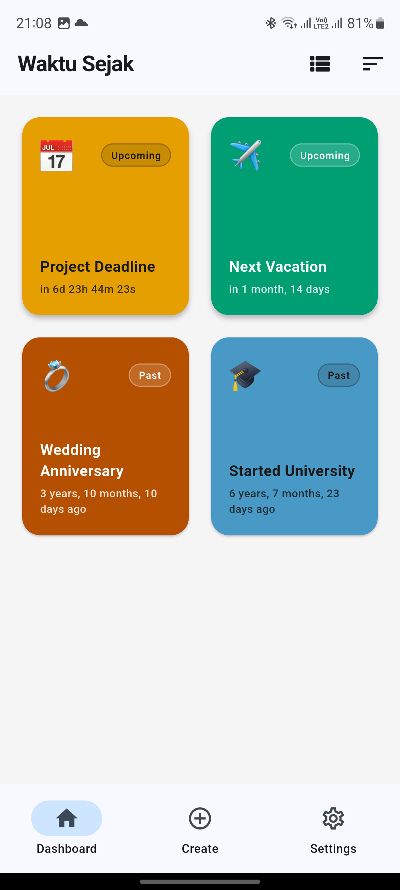
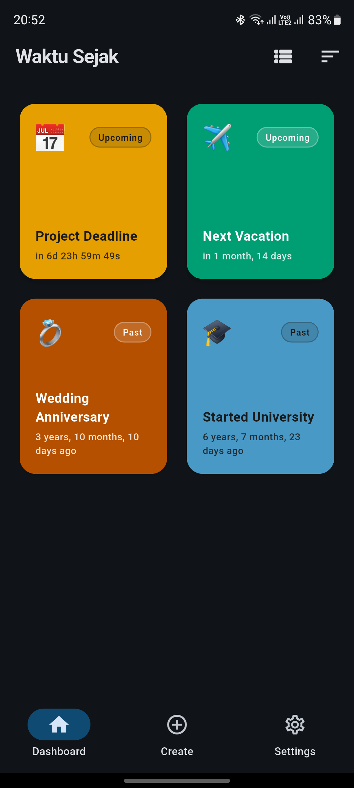
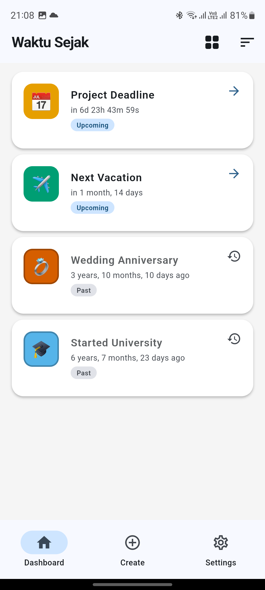
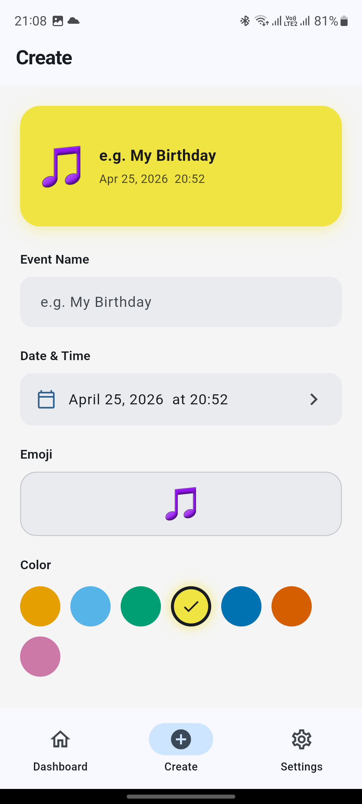
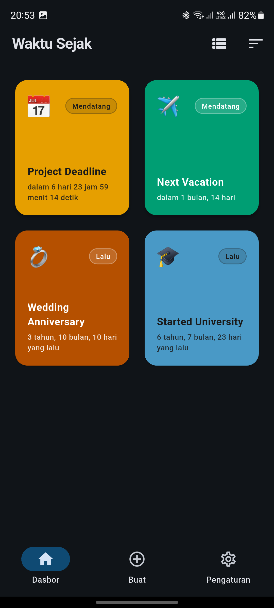
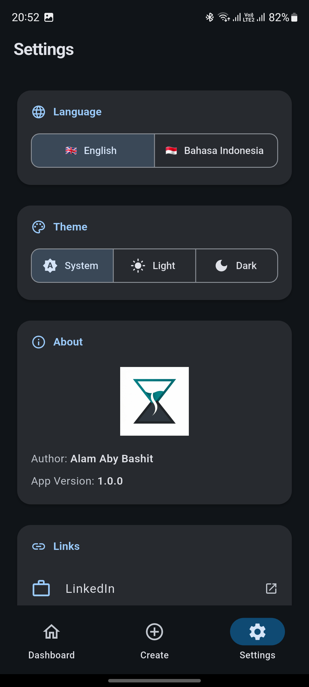

<div align="center">

# ⏳ Waktu Sejak

**A minimalist time-tracking app — know exactly how long ago something happened, or how long until it does.**


*"Waktu Sejak" means "Time Since" in Bahasa Indonesia.*

</div>

---

## ✨ Features

### 📊 Dashboard
- **Card & List View** — toggle between a 2-column card grid and a compact list with a single tap
- **Smart Sorting** — sort events by name (A–Z), closest time, or farthest time
- **Live Countdown** — time displays update every second in real time
- **Past vs. Upcoming** — events are visually distinguished with badges and styling

### ➕ Create Event
- **Live Preview** — a preview card updates as you type, so you see exactly what the card will look like
- **Date & Time Picker** — defaults to now; pick any date from 1900 to 2100
- **Random Emoji & Color** — auto-selected on open; override by tapping emoji or color swatch
- **Validation** — empty name is caught before saving

### ⚙️ Settings
- **Language Toggle** — switch between 🇬🇧 English and 🇮🇩 Bahasa Indonesia; all text and time strings update instantly
- **Theme Toggle** — switch between System / Light / Dark mode; preference persists across sessions
- **About Panel** — author info and app version
- **Links** — LinkedIn, GitHub, Blog, Upwork
- **Support** — Buy Me a Coffee, Saweria, Patreon

---

## 🌍 Localization

All user-facing text — including complex human-readable durations — is fully localized:

| English | Bahasa Indonesia |
|---|---|
| 5 years, 3 months, 2 days ago | 5 tahun, 3 bulan, 2 hari yang lalu |
| in 1 month, 14 days | dalam 1 bulan, 14 hari |
| Just now | Baru saja |
| Upcoming | Mendatang |

---

## ♿ Accessibility

- **Color-blind safe palette** — uses the [Okabe-Ito palette](https://jfly.uni-koeln.de/color/) (distinguishable for all common color vision deficiencies)
- **No red/green reliance** — past vs. future events are distinguished by shape, label, and icon — never by color alone
- **Auto-contrast text** — text color on event cards is automatically chosen (dark/light) based on the background luminance

---

## 🛠 Tech Stack

| Layer | Technology |
|---|---|
| Framework | [Flutter](https://flutter.dev) (cross-platform) |
| Language | Dart 3 |
| State Management | [Riverpod 2.x](https://riverpod.dev) with `@riverpod` code generation |
| Architecture | Clean Architecture (Core / Data / Presentation) |
| Localization | `flutter_localizations` + `intl` + ARB files |
| Unique IDs | `uuid` v4 |
| Code Generation | `riverpod_generator`, `build_runner` |

---

## 📁 Project Structure

```
lib/
├── main.dart                          # App entry point
├── core/
│   ├── constants/
│   │   ├── app_colors.dart            # Okabe-Ito palette
│   │   └── theme_constants.dart       # Material 3 theme
│   ├── utils/
│   │   └── time_calculator.dart       # Calendar-accurate time diff
│   └── l10n/
│       ├── app_en.arb                 # English strings
│       ├── app_id.arb                 # Indonesian strings
│       └── generated/                 # Auto-generated delegates
├── data/
│   └── models/event_model.dart        # EventModel data class
└── presentation/
    ├── providers/                     # Riverpod state providers
    ├── screens/                       # Dashboard · Create · Settings
    └── widgets/                       # EventCard, EventListTile, Pickers
```

---

## 🚀 Getting Started

### Prerequisites

- Flutter SDK `>=3.3.0` — [install here](https://docs.flutter.dev/get-started/install)
- Dart SDK `>=3.3.0` (bundled with Flutter)

### Clone & Run

```bash
# 1. Clone the repository
git clone https://github.com/alamaby/waktu-sejak.git
cd waktu-sejak

# 2. Install dependencies
flutter pub get

# 3. Generate Riverpod & localization code
flutter gen-l10n
dart run build_runner build --delete-conflicting-outputs

# 4. Run the app
flutter run
```

### Run on a specific platform

```bash
flutter run -d android   # Android emulator or device
flutter run -d ios       # iOS simulator or device
flutter run -d chrome    # Web (Chrome)
flutter run -d windows   # Windows desktop
```

---

## 🧩 How It Works

Time differences are computed using **calendar-aware arithmetic** (not naive day division):

```
5 years, 3 months, 2 days ago
= correct ✅

vs. naive (5 * 365 + ...) / 30 = wrong ❌
```

The algorithm handles month-length variations, leap years, and time-component carry correctly.

---

## 📸 Screens

| Dashboard (Light) | Dashboard (Dark) | List View |
|:---:|:---:|:---:|
|  |  |  |

| Add Event | Bahasa Indonesia | Settings (Dark) |
|:---:|:---:|:---:|
|  |  |  |

---

## 🗺 Roadmap

- [x] Real-time event tracking (live countdown, past/upcoming badges)
- [x] EN / ID localization
- [x] Color-blind safe UI (Okabe-Ito palette)
- [x] Local persistence (SharedPreferences — events + preferences survive restarts)
- [x] Event editing and deletion
- [x] Dark mode (System / Light / Dark toggle, persisted)
- [x] URL launching for social links
- [x] Home screen widget (Android)
- [ ] Push notification reminders

---

## 👤 Author

**Alam Aby Bashit**

[](https://www.linkedin.com/in/alamaby/)
[](https://github.com/alamaby)
[](https://www.upwork.com/freelancers/~01c341d5c6f089ea32)

---

## 📄 License

This project is licensed under the terms of the [LICENSE](LICENSE) file included in this repository.
